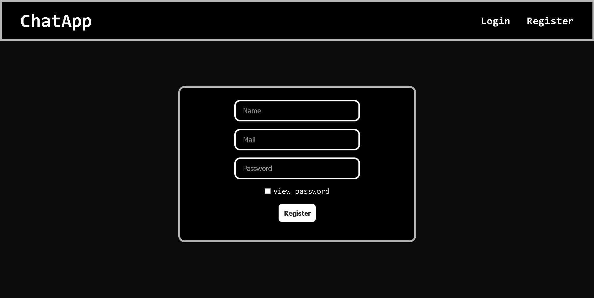
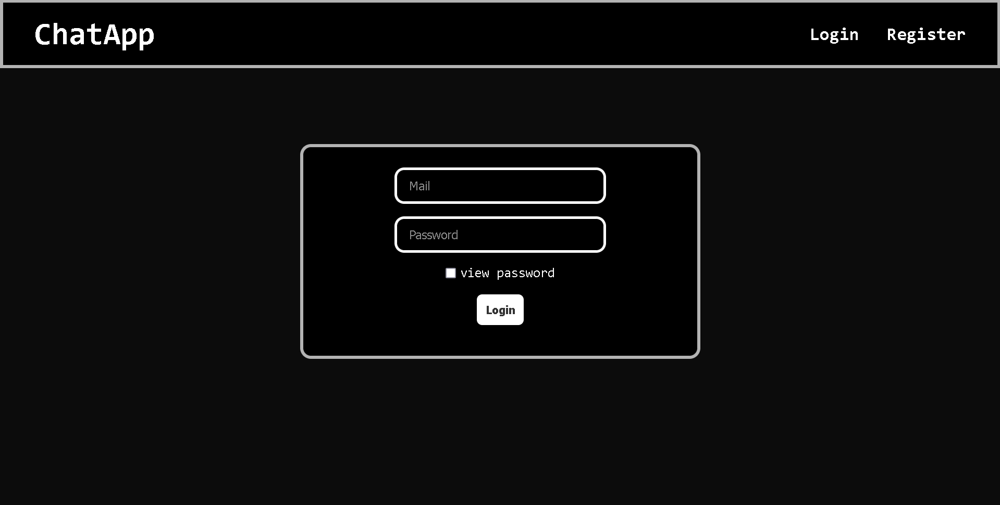
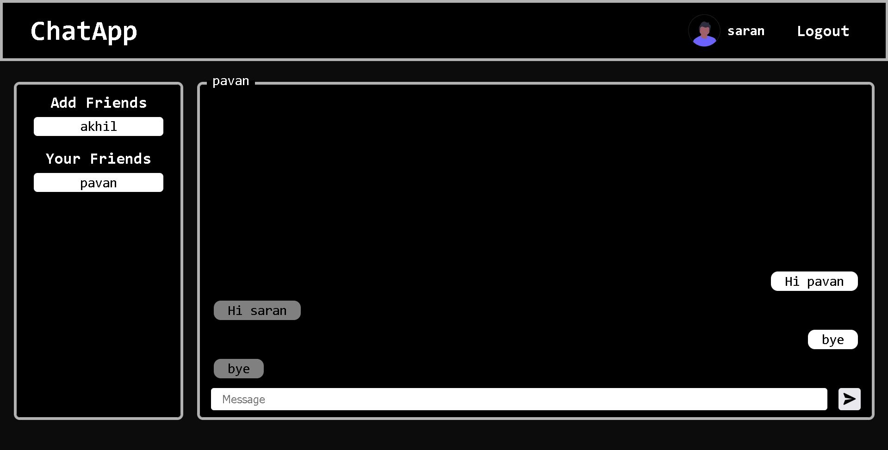
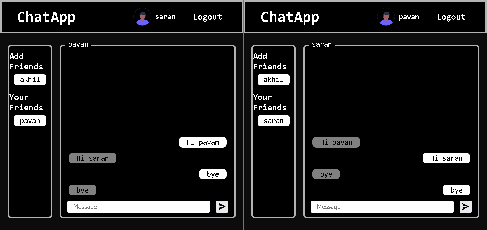

# ChatApp

A real-time chatapp created using MERN stack and Socket IO.

<table>
  <tr>
    <td></td>
    <td></td>
  </tr>
  <tr>
    <td></td>
    <td></td>
  </tr>
</table>

## Demo video:

[](./Demo/chatapp-demo.mp4)

## Setup

- Clone the git repository.
  ```
  git clone "https://github.com/Saran416/ChatApp"
  ```
- now open frontend folder and run the following commands.
  ```
  npm init
  npm install
  npm run dev
  ```
- Open backend folder, fill the [config.js](./backend/config.js) file with port where you want to host the backend and the monogdb url of the database from your mongodbcompass. now run the following commands in the backend folder.
  ```
  npm init
  npm install
  npm run dev
  ```
